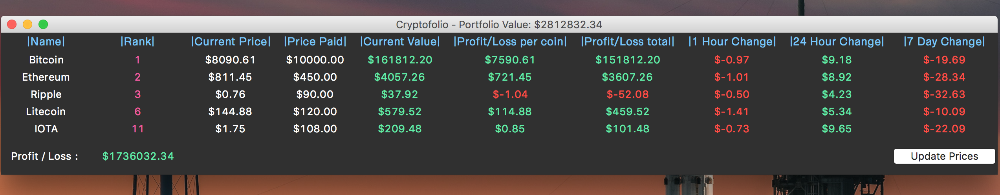

# Cryptofolio
A portfolio for Cryptocurrencies

What Did I Learn?

<ul shape = "circle">
<li> Using an API to fetch JSON</li>
<li> Parse JSON</li>
<li> Build GUI using Tkinter and Python</li>
</ul>

<b> Screenshot: </b>  

